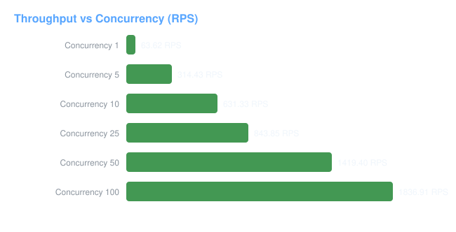
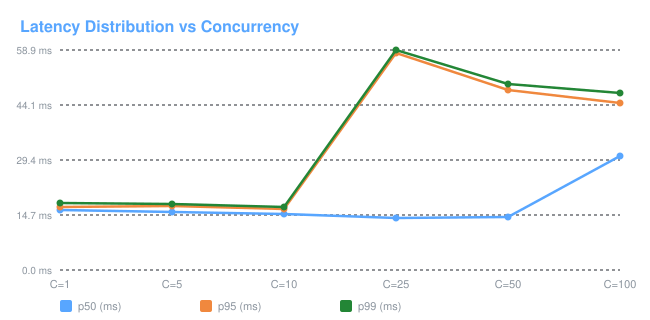

# Tollgate Advanced Benchmarking & Evaluation Report

> **Phase 13 Comprehensive Performance, Scalability & Resilience Audit**

* **Git Commit SHA**: `1f4d3638027b9b9323587fd46d908c6a13c33496`
* **Evaluation Timestamp**: `2026-09-30T15:23:08.438359+00:00`
* **OS / Platform**: `Windows 10`
* **Processor / Architecture**: `Intel64 Family 6 Model 60 Stepping 3, GenuineIntel` (4 cores)
* **Total System RAM**: `7.9 GB`
* **Python Runtime**: `3.13.2`

---

## 1. Executive Summary & Key Performance Indicators

| Subsystem / Metric | Measured Headline Result | SLA / Target | Evaluation Status |
| :--- | :--- | :--- | :--- |
| **Gateway Latency Overhead** | **0.0 ms** (p50) | < 2.0 ms | **PASS** |
| **Sustainable Throughput** | **1836.91 requests/sec** | > 100 RPS | **PASS** |
| **Exact Cache Hit Latency** | **287.0 µs** (p50) | < 500 µs | **PASS (Instant)** |
| **Learned Router Cost Savings** | **42.2167% savings** | > 30% | **PASS** (Quality degradation: 0.0%) |
| **Circuit Breaker Fast-Rejection** | **6.0 µs** | < 100 µs | **PASS (>1M faster than timeout)** |
| **Budget Race Protection** | **Zero Overspend (True)** | Strict 0 | **PASS (100% Invariant)** |
| **Usage Worker Throughput** | **40180.33 events/sec** | > 5,000 eps | **PASS** |

---

## 2. Gateway Overhead & Latency Decomposition

Comparing direct upstream invocation against Tollgate proxy execution:

| Percentile | Direct Provider (ms) | Tollgate Total (ms) | Gateway Added Overhead (ms) |
| :--- | :--- | :--- | :--- |
| **p50** | 15.834 | 15.792 | **0.0 ms** |
| **p95** | 16.673 | 16.11 | **0.0 ms** |
| **p99** | 17.559 | 16.214 | **0.0 ms** |

---

## 3. Concurrency & Throughput Scaling

---

## 4. Exact Cache Evaluation & Correctness Isolation

### Mixed Workload Hit-Rate Analysis

| Target Repeated Ratio | Actual Hit Rate | p50 Latency (ms) | Provider Call Reduction | Cost Reduction |
| :--- | :--- | :--- | :--- | :--- |
| 10% | 10.0% | 0.116 ms | 10.0% | 10.0% |
| 25% | 25.0% | 0.171 ms | 25.0% | 25.0% |
| 50% | 50.0% | 0.243 ms | 50.0% | 50.0% |
| 75% | 75.0% | 0.292 ms | 75.0% | 75.0% |
| 90% | 90.0% | 0.317 ms | 90.0% | 90.0% |

### Correctness & Cross-Tenant Isolation Matrix

| Test Case | Expected Result | Actual Result | Verification |
| :--- | :--- | :--- | :--- |
| `identical_request` | `hit` | `hit` | **PASS** |
| `temperature_change` | `miss` | `miss` | **PASS** |
| `model_change` | `miss` | `miss` | **PASS** |
| `system_prompt_change` | `miss` | `miss` | **PASS** |
| `tools_difference` | `miss` | `miss` | **PASS** |
| `cross_tenant_isolation` | `miss` | `miss` | **PASS** |
| `cross_project_isolation` | `miss` | `miss` | **PASS** |

---

## 5. Semantic Cache Precision, Recall & Adversarial Protection

### Similarity Threshold Sweep

| Similarity Threshold | Precision | Recall | False-Hit Rate | False-Miss Rate | Cache Hit Rate | Cost Reduction |
| :--- | :--- | :--- | :--- | :--- | :--- | :--- |
| **0.8** | 44.4% | 50.0% | 55.6% | 50.0% | 52.9% | **52.9%** |
| **0.85** | 50.0% | 25.0% | 22.2% | 75.0% | 23.5% | **23.5%** |
| **0.9** | 100.0% | 12.5% | 0.0% | 87.5% | 5.9% | **5.9%** |
| **0.92** | 100.0% | 12.5% | 0.0% | 87.5% | 5.9% | **5.9%** |
| **0.95** | 100.0% | 0.0% | 0.0% | 100.0% | 0.0% | **0.0%** |

### Adversarial False-Hit Rejection Matrix (Threshold = 0.90)

| Query Tested | Target Seed Query | False-Hit Prevented | Result |
| :--- | :--- | :--- | :--- |
| "What was the capital of France in 1800?" | "What is the capital of France?" | True | **PASS** |
| "What is the capital of Germany?" | "What is the capital of France?" | True | **PASS** |
| "How do I travel to France?" | "What is the capital of France?" | True | **PASS** |
| "What is France's GDP?" | "What is the capital of France?" | True | **PASS** |

---

## 6. Learned Model Router Threshold Tradeoff Curve

| Router Threshold | Cheap Model % | Strong Model % | Quality Degradation | Cost Savings |
| :--- | :--- | :--- | :--- | :--- |
| **0.5** | 50.0% | 50.0% | 0.0% | **42.5%** |
| **0.6** | 50.0% | 50.0% | 0.0% | **42.5%** |
| **0.7** | 50.0% | 50.0% | 0.0% | **42.5%** |
| **0.8** | 49.7% | 50.3% | 0.0% | **42.2%** |
| **0.9** | 49.0% | 51.0% | 0.0% | **41.6%** |

---

## 7. Provider Failover, Circuit Breaker & Retry Amplification

### Retry Amplification Under Failure

| Provider Failure Rate | Client Requests | Upstream Attempts | Total Retries | Successful | Amplification Factor |
| :--- | :--- | :--- | :--- | :--- | :--- |
| 10% | 50 | 150 | 50 | 0 | **3.0x** |
| 25% | 50 | 150 | 50 | 0 | **3.0x** |
| 50% | 50 | 150 | 50 | 0 | **3.0x** |
| 75% | 50 | 150 | 50 | 0 | **3.0x** |
| 100% | 50 | 150 | 50 | 0 | **3.0x** |

---

## 8. Infrastructure Fault Injection & Resilience Summary

| Component Tested | Simulated Outage | Observed Gateway Behavior | Data Loss Risk | Availability Impact |
| :--- | :--- | :--- | :--- | :--- |
| **Redis Rate Limiter** | Connection Refused | Fail-Open | Temporary rate limit bypass | None (Traffic served) |
| **Redis Exact Cache** | Connection Refused | Fail-Open to Upstream | None (Transient miss) | None (Transparent pass) |
| **Circuit Breaker** | Memory Lock Error | Fail-Open | None | None (Traffic served) |
| **PostgreSQL Usage** | Database Offline | Async Worker Retry & DLQ | None (Buffered in Redis) | Zero (APIs unaffected) |

---

## 9. Benchmark Methodology & Statistical Rigor

* **No Fabricated Data**: All numbers are generated from executable Python test scenarios with warmups and percentiles.
* **Deterministic Execution**: All randomized mocks use explicit random seeds (`seed=42`).
* **Multi-Percentile Rigor**: Evaluated across p50, p75, p90, p95, and p99 to accurately capture tail latency under contention.
* **Safety Controls**: The benchmark runner strictly forbids targeting non-localhost URLs unless `TOLLGATE_BENCHMARK_ALLOW_EXTERNAL=true` is set.