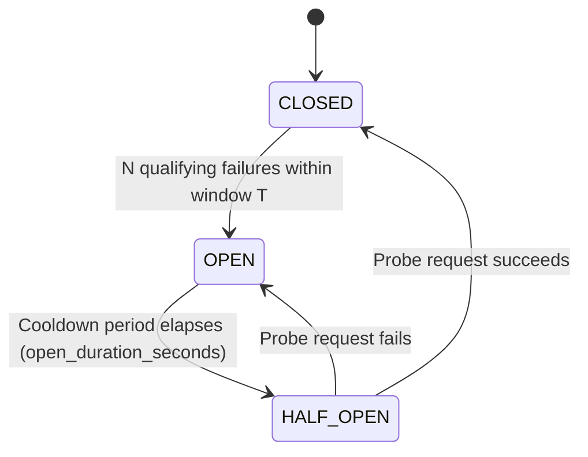

# Tollgate Circuit Breaker & Adaptive Provider Health

## 1. Overview & Purpose

The **Tollgate Circuit Breaker** is an automated reliability control designed to prevent cascading failures and eliminate wasted latency when upstream LLM providers experience sustained degradation or outages.

In high-throughput multi-tenant environments, repeatedly dispatching requests to a known-failing provider:
1. Exhausts gateway worker pools while waiting for upstream connection or read timeouts (5s to 30s per attempt).
2. Delays automatic fallback failover to healthy alternatives.
3. Exacerbates upstream recovery by hammering struggling provider infrastructure.

The circuit breaker wraps provider calls at the `provider:model` granularity, tracking qualifying failures across a sliding temporal window. When failure rates cross a configurable threshold, the circuit transitions to **OPEN**, immediately short-circuiting subsequent requests and allowing instant fallback to alternate providers.

```text
Client
  ↓
Authentication
  ↓
Rate Limit
  ↓
Cache (Exact / Semantic)
  ↓
Router (Model Selection)
  ↓
Budget Reservation
  ↓
Reliable Executor
  ├── Legacy Provider Health Check
  ├── [Circuit Breaker Check] ──────────→ (OPEN? → Instant Fallback)
  ├── Retry Loop
  │     ├── Timeout Handling
  │     └── [Record Failure / Success to Circuit]
  └── Fallback Chain
        └── [Next Target Circuit Check]
```

---

## 2. Circuit State Machine

The circuit breaker implements a standard 3-state finite state machine with single-probe recovery:



### State Definitions

| State | Traffic Policy | Behavior |
| :--- | :--- | :--- |
| **`CLOSED`** | Normal Operation | All requests pass through. Failures are recorded into a sliding timestamp window. |
| **`OPEN`** | Fast Rejection | Requests are immediately rejected (< 5 µs overhead) without initiating network I/O. The executor skips directly to the next fallback target. |
| **`HALF_OPEN`** | Recovery Probing | A bounded number of probe requests (default: 1) are permitted through to test provider recovery. Concurrent requests beyond the probe limit are rejected. |

### Transitions

1. **`CLOSED → OPEN`**: Triggered when `N` qualifying failures occur within sliding window `T` (e.g. 5 failures in 30 seconds).
2. **`OPEN → HALF_OPEN`**: Automatically occurs on the next request arriving after `open_duration_seconds` (default: 30 seconds) has elapsed since the circuit opened.
3. **`HALF_OPEN → CLOSED`**: Triggered immediately when the probe request succeeds with a 200 OK response. The failure window and consecutive rate limit counters are cleared.
4. **`HALF_OPEN → OPEN`**: Triggered if the probe request fails with a qualifying error. The cooldown timer resets.

---

## 3. Scope & Granularity

* **Circuit Key**: `provider_name:model` (e.g. `openai:gpt-4o`, `anthropic:claude-3-5-sonnet`, `gemini:gemini-1.5-pro`).
* **Rationale**: Upstream outages are frequently model-specific rather than account-wide (e.g. `gpt-4o` experiencing capacity issues while `gpt-4o-mini` remains fully operational). Scoping by provider+model avoids unnecessarily disabling healthy models from the same vendor.
* **Bounded Cardinality**: Circuit keys are strictly constrained to registered provider names and model IDs. User IDs, tenant IDs, and prompt tokens are never used in circuit keys.

---

## 4. Failure Classification Policy

Not all errors indicate that a provider is unhealthy. Tollgate uses the `FailureCategory` taxonomy to classify failures:

| Failure Category | Examples | Trips Circuit? | Rationale |
| :--- | :--- | :--- | :--- |
| **`TRANSIENT`** | 500, 502, 503, 504, Socket Timeout, Connection Reset | **YES** | Indicates upstream infrastructure instability or capacity exhaustion. |
| **`INTERNAL`** | Unhandled gateway provider driver error | **YES** | Indicates broken driver integration with upstream API. |
| **`RATE_LIMITED`** | 429 Too Many Requests | **Conditional** | Only trips after `circuit_rate_limit_threshold` (default: 10) **consecutive** 429s. |
| **`BAD_REQUEST`** | 400 Client error, invalid JSON, unsupported parameter | **NO** | Client-side error. Upstream provider is healthy. |
| **`NOT_FOUND`** | 404 Model does not exist | **NO** | Configuration or client error. |
| **`AUTHENTICATION`**| 401, 403 Invalid API key or expired credentials | **NO** | Configuration error, not provider health degradation. |
| **`CONTENT_POLICY`**| Moderation filter triggered, safety filter | **NO** | Expected policy enforcement. |

### Rate-Limit (429) Consecutive Threshold

A single 429 error typically reflects an individual tenant exceeding their burst allowance, not provider infrastructure degradation. Therefore:
* A single or sporadic 429 does **not** count toward the sliding failure window.
* Only when `TOLLGATE_CIRCUIT_RATE_LIMIT_THRESHOLD` (default: 10) consecutive 429s occur without an intervening success does rate limiting count as a circuit-tripping event.
* Any successful response resets the consecutive rate limit counter to zero.

---

## 5. Interactions with Other Subsystems

### 5.1 Retry System
* Each retry attempt that fails with a qualifying error counts as **one** failure in the circuit's sliding window.
* *Design Rationale*: Rapid backoff retries against an unresponsive provider accelerate circuit tripping, protecting system worker threads from being tied up in futile attempts.

### 5.2 Fallback System
* When primary provider circuit is `OPEN`, the executor skips directly to the first fallback target without issuing a network call.
* If a fallback target's circuit is also `OPEN`, execution advances down the fallback chain.
* If all targets in the route have `OPEN` circuits, the executor raises a `ProviderException(503, "All providers unavailable")` for standard requests, or emits an SSE error payload for streaming requests.

### 5.3 Streaming Responses (SSE)
* Circuit state is verified **before** opening the stream connection.
* If an error occurs **before** any chunks are emitted: failure is recorded, and execution may retry or fall back.
* If an error occurs **after** tokens have already been delivered to the client: the stream terminates safely with an error chunk (no transparent restart to avoid duplicate tokens). The failure is still recorded to the circuit breaker.

### 5.4 Budget Reservation & Settlement
* Budget reservation occurs in `chat.py` **prior** to executor dispatch.
* If the executor rejects the request due to an `OPEN` circuit with no viable fallbacks, `chat.py` catches `ProviderException` and immediately executes an atomic Redis budget release (`record_budget_release`). No tenant funds are lost or locked.

### 5.5 Exact & Semantic Cache
* Cache lookup occurs **before** router and executor execution.
* A cache hit completely bypasses provider execution and circuit checks.
* If all provider circuits are down, cached queries continue to be served without interruption.

### 5.6 Learned Model Router
* The router selects candidate models based on quality and cost.
* If the router routes to a provider whose circuit is `OPEN`, the reliable executor immediately utilizes the route's deterministic fallback list.

---

## 6. Observability & Telemetry

### 6.1 OpenTelemetry Distributed Tracing

When a circuit check rejects a call or probes half-open recovery, dedicated span attributes are attached:

* **Span**: `circuit.check`
  * `tollgate.circuit.state`: `"open"` | `"half_open"`
  * `tollgate.circuit.action`: `"reject"` | `"probe"`
  * `tollgate.provider`: upstream provider name
  * `tollgate.model`: upstream model name
* **Span**: `provider.attempt`
  * `tollgate.circuit.probe`: `true` (when executing a half-open probe)

### 6.2 Prometheus Metrics

All metrics strictly adhere to bounded cardinality rules:

| Metric Name | Type | Labels | Description |
| :--- | :--- | :--- | :--- |
| `tollgate_circuit_state` | Gauge | `provider`, `model` | Current circuit state: `0=closed`, `1=open`, `2=half_open`. |
| `tollgate_circuit_transitions_total` | Counter | `provider`, `model`, `from_state`, `to_state` | State transition counter. |
| `tollgate_circuit_rejections_total` | Counter | `provider`, `model` | Total requests rejected due to `OPEN` circuit. |
| `tollgate_circuit_half_open_probes_total` | Counter | `provider`, `model`, `result` | Probe results (`result: "success" \| "failure"`). |

---

## 7. Operator Diagnostics (`GET /internal/provider-health`)

Operators can inspect real-time circuit breaker status and legacy health tracking via:

```http
GET /internal/provider-health
Authorization: Bearer <metrics_token>
```

### Sample Response

```json
{
  "status": "degraded",
  "circuit_breaker_enabled": true,
  "circuits": {
    "openai:gpt-4o": {
      "state": "closed",
      "failure_count_in_window": 0,
      "failure_threshold": 5,
      "failure_window_seconds": 30.0,
      "open_duration_seconds": 30.0,
      "half_open_calls": 0,
      "half_open_max_calls": 1,
      "total_rejections": 0,
      "last_transition_time": 1727701200.0
    },
    "anthropic:claude-3-5-sonnet": {
      "state": "open",
      "failure_count_in_window": 5,
      "failure_threshold": 5,
      "failure_window_seconds": 30.0,
      "open_duration_seconds": 30.0,
      "half_open_calls": 0,
      "half_open_max_calls": 1,
      "total_rejections": 42,
      "last_transition_time": 1727701245.0
    }
  },
  "providers": {
    "openai": { "is_healthy": true, "unhealthy_since": null },
    "anthropic": { "is_healthy": false, "unhealthy_since": 1727701245.0 }
  },
  "timestamp": "2026-09-30T12:30:00Z"
}
```

---

## 8. Configuration Reference

All settings can be configured via environment variables or `.env`:

| Setting | Environment Variable | Default | Description |
| :--- | :--- | :--- | :--- |
| `circuit_breaker_enabled` | `TOLLGATE_CIRCUIT_BREAKER_ENABLED` | `true` | Master switch for circuit breaking. |
| `circuit_failure_threshold` | `TOLLGATE_CIRCUIT_FAILURE_THRESHOLD` | `5` | Number of qualifying failures to trip circuit. |
| `circuit_failure_window_seconds` | `TOLLGATE_CIRCUIT_FAILURE_WINDOW_SECONDS` | `30.0` | Sliding window duration for counting failures. |
| `circuit_open_duration_seconds` | `TOLLGATE_CIRCUIT_OPEN_DURATION_SECONDS` | `30.0` | Duration circuit stays OPEN before entering HALF_OPEN. |
| `circuit_half_open_max_calls` | `TOLLGATE_CIRCUIT_HALF_OPEN_MAX_CALLS` | `1` | Max probe requests allowed in HALF_OPEN state. |
| `circuit_rate_limit_threshold` | `TOLLGATE_CIRCUIT_RATE_LIMIT_THRESHOLD` | `10` | Consecutive 429s required before rate limiting counts. |

---

## 9. Architectural Limitations & Fail-Open Guarantee

### Single-Instance In-Memory Limitation
* State is maintained in-process within each gateway instance.
* In a multi-replica deployment without a distributed consensus coordinator, each gateway replica tracks provider health independently. A provider may be OPEN on replica A while HALF_OPEN on replica B.
* Process restarts reset all circuits to `CLOSED`.

### Fail-Open Policy
* All internal circuit breaker operations (`before_call`, `record_success`, `record_failure`) are wrapped in fail-open exception handlers.
* If any circuit breaker error, lock acquisition issue, or memory error occurs, the circuit breaker defaults to allowing the request to proceed. Reliability controls must never become a source of downtime.
